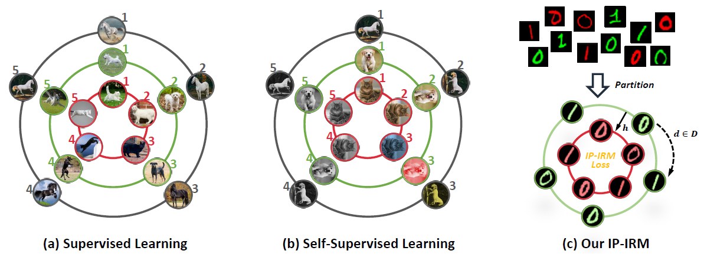
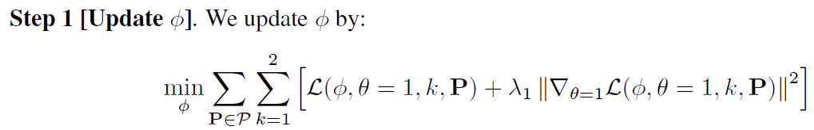
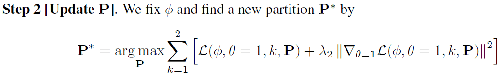

# IP-IRM

This repository contains the official PyTorch implementation of paper "Self-Supervised Learning Disentangled Group Representation as Feature".

**Self-Supervised Learning Disentangled Group Representation as Feature** <br />
[Tan Wang](https://wangt-cn.github.io/), [Zhongqi Yue](https://github.com/yue-zhongqi), Jianqiang Huang, [Qianru Sun](https://qianrusun1015.github.io), [Hanwang Zhang](https://www.ntu.edu.sg/home/hanwangzhang/) <br />
**Conference and Workshop on Neural Information Processing Systems (NeurIPS), 2021  (Spotlight)** <br />
**[[Paper](https://arxiv.org/abs/2110.15255)] [[Poster](https://drive.google.com/file/d/1ETPfpmttHwzuTs98LhAQMKObVJOhUq2U/view?usp=sharing)] [[Slides](https://drive.google.com/file/d/1LUSnsPFMyEGc4S0BPc6ZbmIhC_UMgr-s/view?usp=sharing)] [[Zhihu](https://zhuanlan.zhihu.com/p/483952577)]**<br />


<br />

## IP-IRM Algorithm


<div align="center">
  
</div>


#### 1. Minimization Step

<div align="center">
  
</div>

#### 2. Maximization Step

<div align="center">
  
</div>


<br />

## Prerequisites

- Python 3.7 
- PyTorch 1.6.0
- PIL
- OpenCV
- tqdm


<br />

## Training

#### 1. IP-IRM Main Parameters

- `--maximize_iter`: when to perform the maximize step?
- `--env_num`: , the number of the subsets (orbits)
- `--constrain`:  if perform the constrain for partition updating? (constrain the difference of the number of samples in the 2 subsets not be too large)
- `--retain_group`: retain the previous partition?
- `--penalty_weight`: the penalty (irm loss) weight ()
- `--irm_weight_maxim`: the irm loss weight in partition maximization ()
- `--keep_cont`: maintain the standard SSL loss as the first partition
- `--offline`: if update the partition offline? (i.e., first extract the feature and then optimize the partition)
- `--mixup_max`: if using mixup for maximization step? (We find this option can usually gets a little bit better results but consumes more time)


#### 2. Key Codes & Design

- **Minimization Step**: 
  -  `def train_env()` in `main.py`   
  -  `def train_env_mixup_full_retaingp()` in `main_mixup.py`
- **Maximization Step**:  
  - `def auto_split_offline() / auto_split()` in `utils.py`
  - `def auto_split_online_mixup() / auto_split_offline_mixup()` in `utils_mixup.py`
- **Soft Contrastive Loss**: To enable the calculation of the contrastive loss with the partition updating in maximization, we also change the contrastive into a soft version.
  - `def soft_contrastive_loss()` in `utils.py`
  - `soft_contrastive_loss_mixup_online() / soft_contrastive_loss_mixup_offline()` in `utils_mixup.py`
- **Partition**  : `updated_split` in the code (follow the order of the dataset)


#### 3. Running

1) Training IP-IRM on STL dataset for 400 epochs with updating partition every 50 epochs

```
CUDA_VISIBLE_DEVICES=0,1 python main.py --penalty_weight 0.2 --irm_weight_maxim 0.5 --maximize_iter 50 --random_init --constrain --constrain_relax --dataset STL --epochs 400 --offline --keep_cont --retain_group --name IPIRM_STL_epoch400
```

2) Linear Evaluations

```
CUDA_VISIBLE_DEVICES=0,1 python linear.py --model_path results/STL/IPIRM_STL_epoch400/model_400.pth --dataset STL --txt --name IPIRM_STL_epoch400
```

3) You can also directly follow the `.sh` file in the `runsh` directory


#### 4. Pretrained Model

|                           | Epoch | $\lambda_1$ | $\lambda_2$ | Temperature |   Arch   | Latent Dim | Batch Size | Accuracy(%) |                           Download                           |
| ------------------------- | :---: | :---------: | :---------: | :---------: | :------: | :--------: | :--------: | :---------: | :----------------------------------------------------------: |
| IP-IRM                    |  400  |     0.2     |     0.5     |     0.5     | ResNet50 |    128     |    256     |    84.44    | [model](https://1drv.ms/u/s!AgehagLcK_klvj4eQFbT9hANEVXl?e=nU4Hk1) |
| IP-IRM+MixUp              |  400  |     0.2     |     0.5     |     0.2     | ResNet50 |    128     |    256     |    88.26    | [model](https://1drv.ms/u/s!AgehagLcK_klvj4eQFbT9hANEVXl?e=nU4Hk1) |
| IP-IRM+MixUp (1000epochs) | 1000  |     0.2     |     0.5     |     0.2     | ResNet50 |    128     |    256     |    90.59    | [model](https://1drv.ms/u/s!AgehagLcK_klvj4eQFbT9hANEVXl?e=nU4Hk1) |


<br />

## Tips for adopting IP-IRM

Here we provide some of our experience when improving IP-IRM which may provide some insights (future direction) for you.

- Though we provide the theoretical proof (see Appendix) for our IP-IRM, the optimization process is still tricky. For example, when to perform maximization? train the maximization step for how many epochs?  How to decide when a step achieves convergence? ... Many of questions can be further explored.
- There are some compromises in practice in terms of time-consuming, which can be improved. For example, the offline training for maximization process is just a kind of compromise. In mixup training, controlling the length of the partition set is also a compromise.
- Revise the maximize process to a kind of RL learning? (more intuitive)
- Adopting IP-IRM in other SSL methods
- The spirits of the IP-IRM (i.e., data partition) can also be utilized into other tasks, even other domains (e.g., pls check our ICCV2021 paper on OOD generalization)


<br />

## BibTex

If you find our codes helpful, please cite our paper:

```
@inproceedings{wang2021self,
  title={Self-Supervised Learning Disentangled Group Representation as Feature},
  author={Wang, Tan and Yue, Zhongqi and Huang, Jianqiang and Sun, Qianru and Zhang, Hanwang},
  booktitle={Conference and Workshop on Neural Information Processing Systems (NeurIPS)},
  year={2021}
}

@inproceedings{wang2021causal,
  title={Causal attention for unbiased visual recognition},
  author={Wang, Tan and Zhou, Chang and Sun, Qianru and Zhang, Hanwang},
  booktitle={Proceedings of the IEEE/CVF International Conference on Computer Vision},
  pages={3091--3100},
  year={2021}
}
```

<br />

## Acknowledgement

Part of this code is inspired by [DCL](https://github.com/chingyaoc/DCL).


If you have any questions, please feel free to email me (TAN317@ntu.edu.sg).
